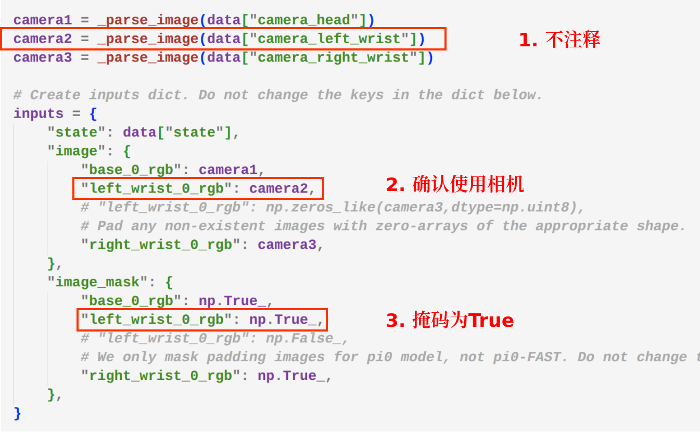
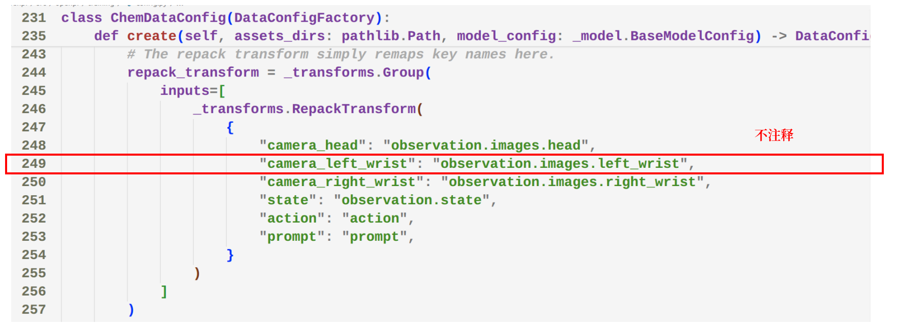
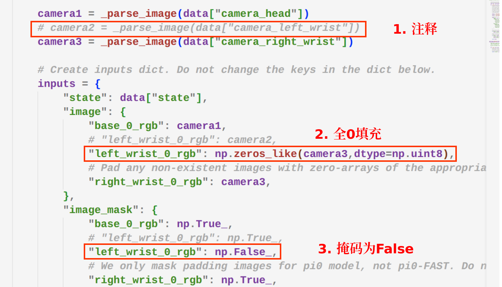
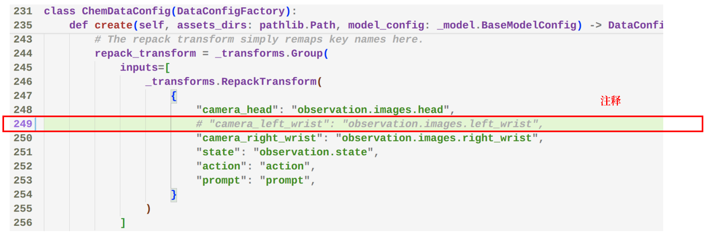
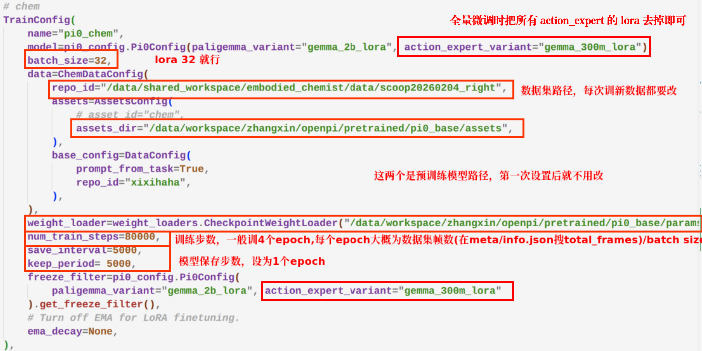

# 模型训练
1. 单/双臂配置确认
   + 双臂训练：
     + openpi/src/openpi/policies/chem_policy.py：
     
     + openpi/src/openpi/training/config.py:
   + 单臂训练：
     + openpi/src/openpi/policies/chem_policy.py：
     + openpi/src/openpi/training/config.py:!
  
2. 训练参数修改：
3. 计算归一化参数以及训练
```bash
# 例子，按实际情况修改
# 归一化参数
CUDA_VISIBLE_DEVICES=1 uv run --no-sync scripts/compute_norm_stats.py --config-name pi05_chem

# 训练
nohup env CUDA_VISIBLE_DEVICES=1,2,3,5 XLA_PYTHON_CLIENT_MEM_FRACTION=.85   uv run --no-sync scripts/train.py pi05_chem   --exp-name scoop_right   --overwrite   --wandb_enabled   > output_train.log 2>&1 &
```

# 模型部署
```
nohup env CUDA_VISIBLE_DEVICES=6 XLA_PYTHON_CLIENT_MEM_FRACTION=.85 uv run --no-sync scripts/serve_policy.py policy:checkpoint --policy.config=pi05_chem --policy.dir=checkpoints/pi05_chem/scoop_right_v1/10000 > output_serve.log 2>&1 &
```